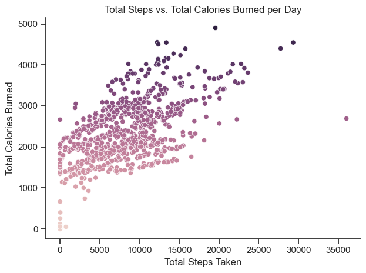
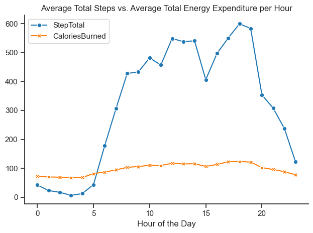
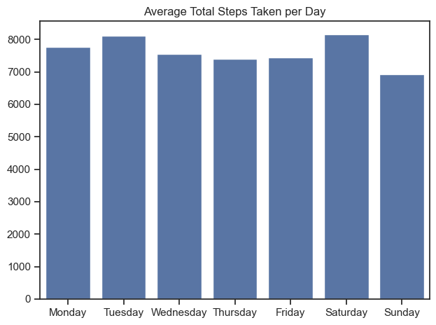
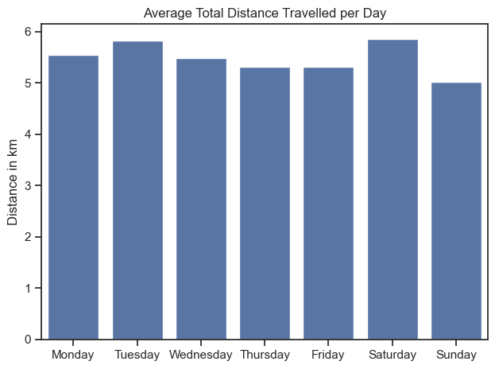
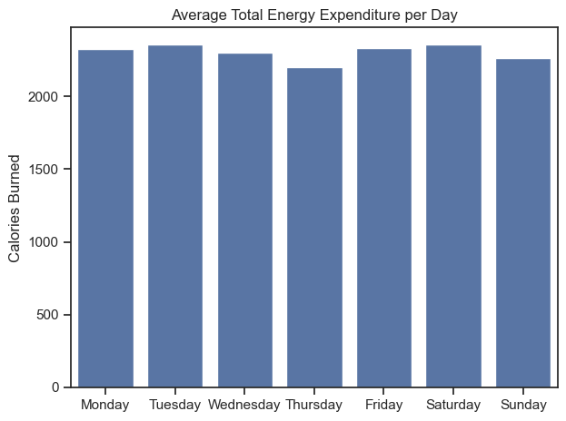
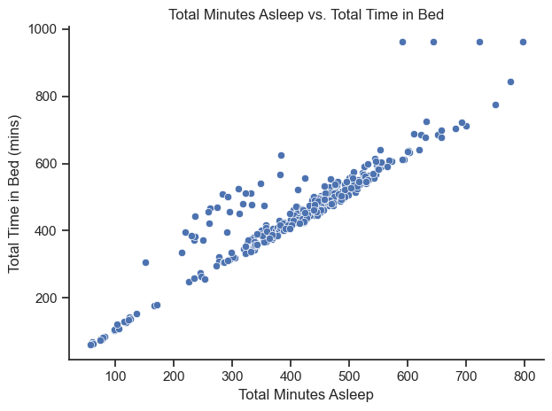
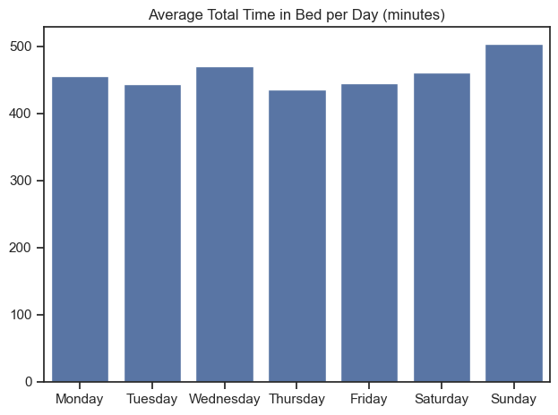
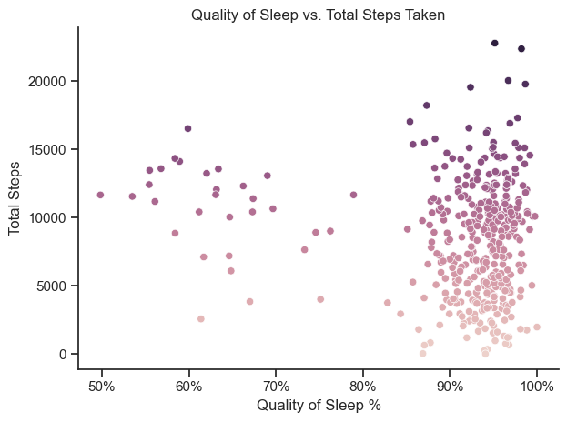
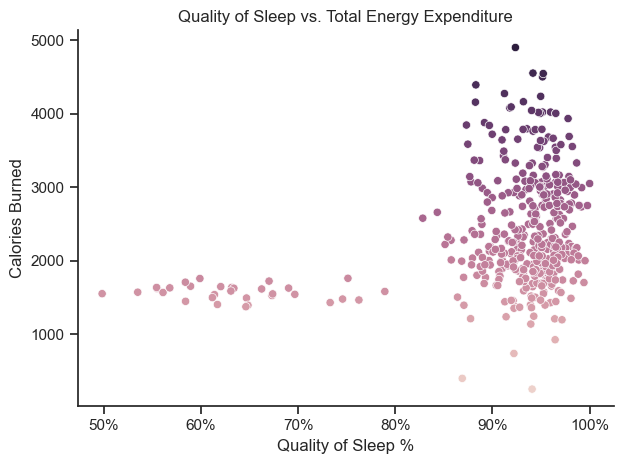

# 👋🏼 Introduction
This is the capstone project I worked on after finishing the Google Data Analytics Professional Certificate Course. In this project I focused on Bellabeat, a high-tech manufacturer of health-focused products for women. My task was to analyze smart device fitness data to gain insights into how consumers use their smart devices, in order to provide guidance for the Bellabeat marketing strategy. I used Python to analyze the given dataset and dive into the personal fitness data of 30 Fitbit users. Leveraging this data, I unlocked new insights and made recommendations for the Bellabeat app and membership program.

The provided dataset was made publicly available [here](https://www.kaggle.com/datasets/arashnic/fitbit/data) and has the license of CC0: Public Domain. It contains the personal tracker data of 30 eligible Fitbit users.

# 📖 Background
You are a junior data analyst working on the marketing analyst team at Bellabeat, a high-tech manufacturer of health-focused products for women. Bellabeat is a successful small company, but they have the potential to become a larger player in the global smart device market. Urška Sršen, cofounder and Chief Creative Officer of Bellabeat, believes that analyzing smart device fitness data could help unlock new growth opportunities for the company. You have been asked to focus on one of Bellabeat’s products and analyze smart device data to gain insight into how consumers are using their smart devices. The insights you discover will then help guide marketing strategy for the company. You will present your analysis to the Bellabeat executive team along with your high-level recommendations for Bellabeat’s marketing strategy.

# 🤔 The Questions

1. What are some trends in smart device usage?
2. How could these trends apply to Bellabeat customers?
3. How could these trends help influence Bellabeat marketing strategy?

# 🔧 Tools I Used

For this project, I used these key tools:

- **Python:** This allowed me to analyze the given data and uncover valuable insights. I also used these libraries:
    - **Pandas Library:** For analyzing data
    - **Matplotlib Library:** For visualizing data
    - **Seaborn Library:** For more advanced visualizations
- **Visual Studio Code:** This made executing Python scripts more convenient and efficient.
- **Git & Github:** These allowed me to share my Python scripts and analysis, and made sure versions were kept up to date.

# 📊 The Analysis

## Data Exploration
I started by importing the data into my jupyter notebook and exploring the dataset. View my notebook with detailed steps here: [1_Prepare.ipynb](bellabeat_proj/1_Prepare.ipynb)

Checking unique values
```python
print(daily_activity.Id.nunique())
print(hourly_calories.Id.nunique())
print(hourly_steps.Id.nunique())
print(sleep_day.Id.nunique())
```

Checking data types
```python
daily_activity.dtypes
hourly_calories.dtypes
hourly_steps.dtypes
sleep_day.dtypes
```

Checking for null values
```python
print(daily_activity.isnull().values.sum())
print(hourly_calories.isnull().values.sum())
print(hourly_steps.isnull().values.sum())
print(sleep_day.isnull().values.sum())
```

## Data Preparation

The next step was to clean and prepare the data for analysis. View my notebook with detailed steps on my preparation here: [2_Process_and_Analyze](bellabeat_proj/2_Process_and_Analyze.ipynb)

I needed to transform some data types from object to datetime.
```python
daily_activity["ActivityDate"] = pd.to_datetime(daily_activity["ActivityDate"])
hourly_calories["ActivityHour"] = pd.to_datetime(hourly_calories["ActivityHour"])
hourly_steps["ActivityHour"] = pd.to_datetime(hourly_calories["ActivityHour"])
sleep_day["SleepDay"] = pd.to_datetime(sleep_day["SleepDay"])
```

I then merged hourly steps and hourly calories to create one hourly data table.
```python
hourly_data = pd.merge(hourly_steps, hourly_calories, how='inner', on=['Id', 'ActivityHour'])
hourly_data.head()
```

I also extracted the day from the datetime columns in each table, so I could analyze patterns based on day of the week.
```python
daily_activity["Day"] = daily_activity["ActivityDate"].dt.day_name()
hourly_data["Day"] = hourly_data["ActivityHour"].dt.day_name()
sleep_day["Day"] = sleep_day["SleepDay"].dt.day_name()
```

After tidying up my tables a bit more, my data was ready for analysis.

## Data Visualization

### For me, the best way to go about analyzing the data was to visualize relationships and gain insights from the visualizations. Let's start with activity data (steps, distance, and calories).

**1. Total Steps vs. Total Calories Burned**
```python
sns.scatterplot(data=daily_activity, x='TotalSteps', y='Calories', hue='Calories', legend=False)
sns.despine()
sns.set_theme(style='ticks')

plt.xlabel('Total Steps Taken')
plt.ylabel('Total Calories Burned')
plt.title('Total Steps vs. Total Calories Burned per Day')
plt.tight_layout()
plt.show()
```


This graph tells me that total steps and total calories are positively correlated. The more steps taken in a day, the more calories burned.

**2. Average Total Steps vs. Average Total Energy Expenditure per Hour**
```python
sns.lineplot(data=hourly_table, dashes=False, palette='tab10', markers=True)
sns.set_theme(style='ticks')
sns.despine()

plt.xlabel('Hour of the Day')
plt.ylabel('')
plt.title('Average Total Steps vs. Average Total Energy Expenditure per Hour')
plt.tight_layout()
plt.show()
```


The step count starts increasing around 7AM, which could be when users most likely start their day. It increases again around 12NN, the lunch hour, and then declines before increasing again around 5-6PM, which could be related to working hours. It then shows a significant drop as users likely wind down for bed.
Calories burned experiences slight variations, showing slight increases and decreases with the associated step count.

**3. Average Total Steps per Day**
```python
day_order = ['Monday', 'Tuesday', 'Wednesday', 'Thursday', 'Friday', 'Saturday', 'Sunday']

sns.set_theme(style='ticks')

sns.barplot(data=da_table, x='Day', y='TotalSteps', order=day_order)

plt.xlabel('')
plt.ylabel('')
plt.title('Average Total Steps Taken per Day')
plt.tight_layout()
plt.show()
```


Total steps varies slightly throughout the week, with the highest count being on Tuesdays and Saturdays, and the lowest on Sundays. This could be associated with Sunday being a day of rest for most users.

**4. Average Total Distance per Day**
```python
day_order = ['Monday', 'Tuesday', 'Wednesday', 'Thursday', 'Friday', 'Saturday', 'Sunday']

sns.set_theme(style='ticks')

sns.barplot(data=da_table, x='Day', y='TotalDistance', order=day_order)

plt.xlabel('')
plt.ylabel('Distance in km')
plt.title('Average Total Distance Travelled per Day')
plt.tight_layout()
plt.show()
```


This graph clearly correlates with the previous one, with distance travelled being higher on Tuesdays and Saturdays, and lowest on Sundays.

**5. Average Total Energy Expenditure per Day**
```python
day_order = ['Monday', 'Tuesday', 'Wednesday', 'Thursday', 'Friday', 'Saturday', 'Sunday']

sns.set_theme(style='ticks')

sns.barplot(data=da_table, x='Day', y='Calories', order=day_order)

plt.xlabel('')
plt.ylabel('Calories Burned')
plt.title('Average Total Energy Expenditure per Day')
plt.tight_layout()
plt.show()
```


There is a slight variation in the amount of calories burned throughout the week, with Thursday being the lowest. This could be related to a dip in energy in the middle of the week.

### Now let's analyze sleep data (minutes asleep, time in bed, quality of sleep).

**1. Total Minutes Asleep vs. Total Time in Bed**
```python
sns.scatterplot(data=sleep_day, x='TotalMinutesAsleep', y='TotalTimeInBed', legend=False)
sns.despine()
sns.set_theme(style='ticks')

plt.xlabel('Total Minutes Asleep')
plt.ylabel('Total Time in Bed (mins)')
plt.title('Total Minutes Asleep vs. Total Time in Bed')
plt.tight_layout()
plt.show()
```


The graph shows a positive correlation between the two variables. There are a few outliers which show some cases of total minutes asleep being less than total time in bed, which could be related to users experiencing difficulty sleeping.

**2. Average Total Minutes Asleep per Day**
```python
sns.set_theme(style='ticks')

sns.barplot(data=sleepdaily, x='Day', y='TotalMinutesAsleep', order=day_order)

plt.xlabel('')
plt.ylabel('')
plt.title('Average Total Minutes Asleep per Day')
plt.tight_layout()
plt.show()
```


Users experience more sleep on Sundays, which again could be because Sunday is a day of rest.

**3. Average Total Time in Bed per Day**
```python
sns.set_theme(style='ticks')

sns.barplot(data=sleepdaily, x='Day', y='TotalTimeInBed', order=day_order)

plt.xlabel('')
plt.ylabel('')
plt.title('Average Total Time in Bed per Day')
plt.tight_layout()
plt.show()
```


This graph correlates with the previous one, showing more time in bed on Sundays.

### Let's merge activity data and sleep data and analyze it to see if there are any relevant relationships.

**1. Quality of Sleep vs. Total Steps Taken**
```python
from matplotlib.ticker import PercentFormatter

sns.scatterplot(data=activity_and_sleep, x='SleepQuality', y='TotalSteps', hue='TotalSteps', legend=False)
sns.despine()
sns.set_theme(style='ticks')

ax = plt.gca()
ax.xaxis.set_major_formatter(PercentFormatter(decimals=0))

plt.xlabel('Quality of Sleep %')
plt.ylabel('Total Steps')
plt.title('Quality of Sleep vs. Total Steps Taken')
plt.tight_layout()
plt.show()
```


A lower quality of sleep does not necessarily result in a lower step total. This could be because some users walk to work everyday, regardless of their sleep quality. However, the cluster of points around the 90-100% sleep quality region shows that most users get quality sleep, and acquire varying step totals. The highest step counts are associated with better quality sleep.

**2. Quality of Sleep vs. Total Energy Expenditure**
```python
from matplotlib.ticker import PercentFormatter

sns.scatterplot(data=activity_and_sleep, x='SleepQuality', y='Calories', hue='Calories', legend=False)
sns.despine()
sns.set_theme(style='ticks')

ax = plt.gca()
ax.xaxis.set_major_formatter(PercentFormatter(decimals=0))

plt.xlabel('Quality of Sleep %')
plt.ylabel('Calories Burned')
plt.title('Quality of Sleep vs. Total Energy Expenditure')
plt.tight_layout()
plt.show()
```


Most users who reached higher amounts of calories burned also had a sleep quality of 85-100%. This shows a positive relationship between the variables, with better sleep resulting in more calories burned.

# 🔎 Main Takeaways

- **Activity and Sleep Tracking**: Fitbit users mainly use this device to track their steps, calories burned, and sleep data, much like other health tracking devices.
- **Variation in Activity**: Throughout each day, there are certain hours that show higher activity compared to others, which can be related to the natural course of the day. However, total steps, distrance travelled, and calories burned vary only slightly throughout the week, with Sunday commonly showing the lowest values. This points to Sunday being a rest day for most users.
- **Importance of Sleep**: Sleep quality and energy expenditure were shown to affect each other. Higher quality of sleep can lead to more calories burned, and burning more calories throughout the day can lead to a better sleep at night. This highlights the valuable impact of good quality sleep.

# ☝🏻 Recommendations

### Based on my analysis, here are my recommendations for the marketing strategy:

**For Bellabeat membership program subscribers:**
1. **Personalized Fitness Plan**
    - Bellabeat should offer personalized fitness plans based on each user's unique lifestyle.
    - Leveraging data on hourly activity patterns, they can recommend the most optimal time of day to engage in physical activity.
    - Leveraging data on daily activity patterns, they can suggest different types of workouts for least active and most active days.
    - Marketing message example: *Tiring day at the office? Here are 3 low-impact workouts you can do from home.*
2. **Personalized Sleep Recommendations**
    - Bellabeat should highlight the importance of sleep by providing personalized sleep insights and recommendations.
    - Leveraging data on total minutes asleep and total time in bed, they can create a personalized nighttime routine that will help users have better quality sleep.
    - Leveraging data on the relationships between sleep quality and daily activity, they can highlight how the user's sleep data has an impact on their daily steps and calories burned, and vice versa.
    - Marketing message example: *Move better, snooze better. You slept for 8hrs last night and burned 2150 calories today. Here are 3 recommendations to keep it up.*
3. **Exclusive Health and Fitness Content**
    - Bellabeat can work with health and fitness professionals to create exclusive in-app content (e.g. articles, videos, recipes) which will be available for members only.
    - Aside from the personalized plans mentioned above, they can also leverage user data to recommend specific types of content that the user is likely to enjoy.
    - Marketing message example: *Your sleep quality has gone down 3% over the past week. Try these meditations for a more peaceful rest.*

**For the general Bellabeat app:**
1. **Goal Setting and Progress Tracking**
    - Once the app is downloaded, Bellabeat can prompt the users to set specific health and fitness goals.
    - The app interface can feature a progress bar that shows how close the user is to achieving their goals for the day, week, and month. This will encourage users to monitor their progress.
    - Marketing message example: *Your step count for the day is currently at 8,500. Put in 1,500 more to reach your target!*
2. **Challenges and Milestones**
    - Bellabeat can promote challenges and milestones that will keep users on track to reach their personal goals.
    - Leveraging daily activity and sleep data, they can recommend specific challenges and milestones that are aligned with the user's goals.
    - Marketing message example: *Humpday challenge: Don't let the midweek slump get you down. You're 2000 steps away from your goal today!*
3. **Notifications**
    - Bellabeat can make use of notifications to keep the users engaged with the app.
    - Leveraging data on hourly activity, they can notify users with a friendly reminder or motivational message to maximize calorie burn during peak activity hours.
    - Leveraging data on time in bed and total minutes asleep, they can notify users when it's time to start winding down for optimal sleep quality.
    - Marketing message example: *You crushed it at work today! Now it's time to crush it at the gym, go-getter!*

# 🏁 Conclusions
1. Bellabeat can leverage user data to create personalized plans and content for paid members of their app. This can help attract more customers to subscribe to the membership program and retain existing members.
2. Bellabeat can keep user engagement high by making their app more interactive with personal goals, fun challenges, and motivational notifications.


# 📣 Closing Remarks
### Data Limitations
The first thing I noticed about the Fitbit dataset I was given to work with was that the data was **not sex disaggregated.** It would have been helpful to have another column that indicated whether the user was male or female. This would have significantly impacted the analysis and recommendations especially given that Bellabeat focuses on products for women. Sex disaggregated data would have helped me discover differences between male vs. female data, and leverage these insights to make the marketing strategy more tailored towards women. The second thing I noticed was that **the sample was small,** consisting of only around 30 participants. Since we don't know the ratio of male to female participants, we also don't know how credible this data really is in making recommendations for a women-focused brand.

### More Research
For future marketing improvements, Bellabeat can collect more data on their own consumers and compare this to data on users of Fitbit, Apple Watch, and other popular fitness tracker brands. Of course, for this to happen, more data must be collected and made publicly available by these brands as well.

### Final Thoughts
In all, working on this case study shed light on the importance of good quality data in making business decisions. Working with very limited data will also give you limited results. However, we also shouldn't let limited data hinder us from discovering valuable insights. It's important to do as much as we can with the available data, for business decisions are made stronger with real evidence to back them up. This project helped me practice my data analysis skills on real-world scenarios, and made me eager to learn and grow more as an analyst.